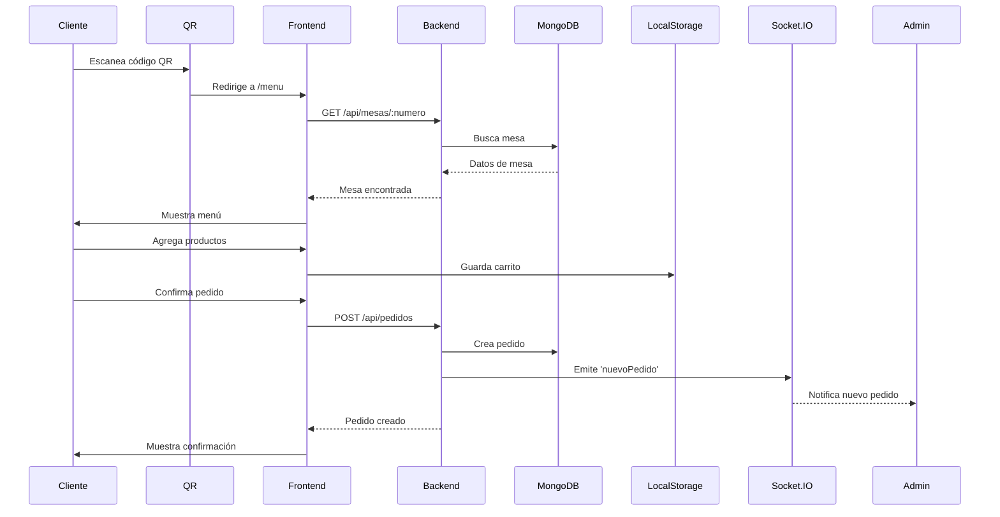
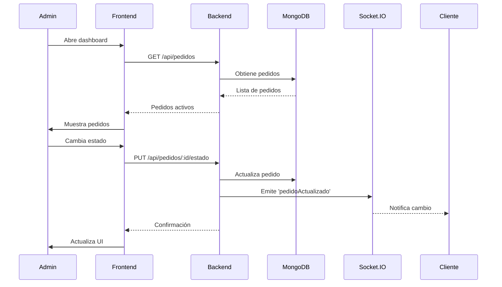
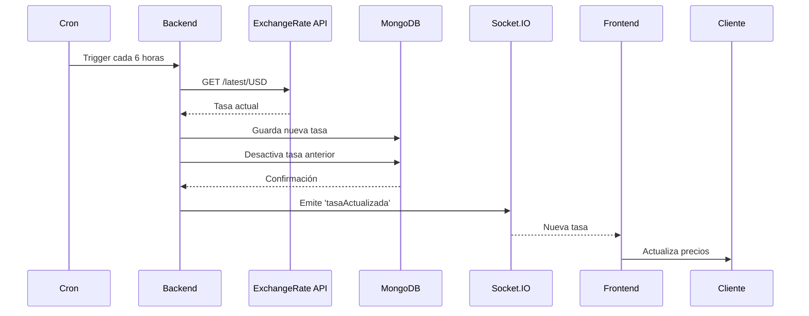

# 📚 Documentación Técnica Completa - Sierra Yara Café

## 🎯 Resumen Ejecutivo

**Sierra Yara Café** es un sistema de menú digital inteligente que permite a los clientes realizar pedidos desde sus dispositivos móviles mediante códigos QR únicos por mesa, mientras que el personal administrativo gestiona pedidos, productos, inventario y configuraciones en tiempo real.

---

## 🏗️ Arquitectura del Sistema

### Stack Tecnológico

#### **Frontend**
- **Framework:** React 18.2.0
- **Routing:** React Router DOM 6.x
- **Estilos:** TailwindCSS 3.x
- **UI Components:** Ant Design 5.x
- **Iconos:** Lucide React
- **Estado Global:** Context API
- **Comunicación Real-time:** Socket.IO Client
- **HTTP Client:** Axios
- **Build Tool:** Create React App

#### **Backend**
- **Runtime:** Node.js 18+
- **Framework:** Express.js 4.18
- **Base de Datos:** MongoDB (Atlas)
- **ODM:** Mongoose 8.0
- **Real-time:** Socket.IO 4.6
- **Validación:** Express Validator
- **CORS:** Habilitado para múltiples orígenes
- **Cron Jobs:** node-cron 3.0

#### **Infraestructura**
- **Frontend Hosting:** Vercel
- **Backend Hosting:** Render
- **Database:** MongoDB Atlas
- **CDN:** Vercel Edge Network
- **SSL:** Automático (Let's Encrypt)

---

## 📁 Estructura del Proyecto

```
sierra-yara/
├── frontend/                    # Aplicación React
│   ├── public/
│   │   ├── index.html          # HTML principal
│   │   ├── manifest.json       # PWA manifest
│   │   └── logo.png            # Logo/Favicon
│   ├── src/
│   │   ├── assets/             # Imágenes y recursos
│   │   ├── components/
│   │   │   ├── admin/          # Componentes del panel admin
│   │   │   ├── cliente/        # Componentes del menú cliente
│   │   │   └── common/         # Componentes compartidos
│   │   ├── context/            # Context API providers
│   │   ├── hooks/              # Custom hooks
│   │   ├── routes/             # Configuración de rutas
│   │   ├── services/           # APIs y servicios
│   │   ├── utils/              # Funciones auxiliares
│   │   ├── App.js              # Componente raíz
│   │   └── index.js            # Entry point
│   └── package.json
│
├── backend/                     # API Node.js
│   ├── config/
│   │   └── database.js         # Configuración MongoDB
│   ├── controllers/            # Lógica de negocio
│   ├── models/                 # Esquemas Mongoose
│   ├── routes/                 # Definición de rutas
│   ├── scripts/                # Scripts de utilidad
│   ├── server.js               # Servidor Express
│   └── package.json
│
└── docs/                        # Documentación
    ├── DEPLOY_RENDER.md
    ├── PERSISTENCIA_DATOS.md
    ├── TASA_BCV_README.md
    └── DOCUMENTACION_TECNICA.md
```

---

## 🔐 Modelos de Datos

### **1. Mesa (Table)**
```javascript
{
  _id: ObjectId,
  numeroMesa: Number,              // 1, 2, 3, etc.
  capacidad: Number,               // Número de personas
  estado: String,                  // 'libre', 'ocupada', 'reservada'
  dispositivosActivos: [String],   // IDs de dispositivos conectados
  pedidos: [ObjectId],             // Referencias a pedidos
  totalMesa: Number,               // Total acumulado
  horaOcupacion: Date,            // Cuando se ocupó
  createdAt: Date,
  updatedAt: Date
}
```

### **2. Producto (Product)**
```javascript
{
  _id: ObjectId,
  nombre: String,                  // "Café Americano"
  descripcion: String,
  precio: Number,                  // En USD
  categoria: String,               // "Bebidas", "Comidas", etc.
  imagenUrl: String,               // URL de la imagen
  disponible: Boolean,
  stock: Number,                   // Cantidad disponible
  stockMinimo: Number,             // Alerta de stock bajo
  createdAt: Date,
  updatedAt: Date
}
```

### **3. Pedido (Order)**
```javascript
{
  _id: ObjectId,
  mesaId: ObjectId,                // Referencia a Mesa
  dispositivoId: String,           // UUID del dispositivo
  nombreUsuario: String,           // Nombre del cliente
  items: [{
    productoId: ObjectId,          // Referencia a Producto
    nombreProducto: String,
    cantidad: Number,
    precio: Number,
    subtotal: Number,
    personalizaciones: Object      // Extras, modificaciones
  }],
  subtotal: Number,
  propina: Number,
  total: Number,
  estado: String,                  // 'recibido', 'en_preparacion', 'listo', 'entregado', 'cancelado'
  metodoPago: String,              // 'efectivo', 'transferencia', 'pago_movil', etc.
  pagado: Boolean,
  referenciaPago: String,
  notasEspeciales: String,
  createdAt: Date,
  updatedAt: Date
}
```

### **4. Promoción (Promotion)**
```javascript
{
  _id: ObjectId,
  titulo: String,                  // "Happy Hour"
  descripcion: String,
  tipoDescuento: String,           // 'porcentaje', 'fijo'
  descuento: Number,               // 20 (%) o 5.00 (USD)
  productos: [ObjectId],           // Productos en promoción
  fechaInicio: Date,
  fechaFin: Date,
  activa: Boolean,
  diasSemana: [Number],            // 0-6 (Domingo-Sábado)
  horaInicio: String,              // "18:00"
  horaFin: String,                 // "22:00"
  createdAt: Date,
  updatedAt: Date
}
```

### **5. TasaBCV (Exchange Rate)**
```javascript
{
  _id: ObjectId,
  valor: Number,                   // 36.50
  fuente: String,                  // 'api', 'manual'
  actualizadoPor: String,          // 'sistema', 'Admin'
  notas: String,
  activa: Boolean,                 // Solo una puede estar activa
  createdAt: Date,
  updatedAt: Date
}
```

---

## 🔄 Flujos de Trabajo

### **Flujo 1: Cliente Realiza Pedido**



### **Flujo 2: Admin Gestiona Pedido**



### **Flujo 3: Actualización de Tasa BCV**



---

## 🎨 Contextos y Estado Global

### **1. MesaContext**
**Propósito:** Gestionar la sesión de mesa del cliente

```javascript
{
  mesaActual: Object,              // Datos de la mesa
  dispositivoId: String,           // UUID del dispositivo
  nombreUsuario: String,           // Nombre del cliente
  cargando: Boolean,
  error: String,
  
  // Métodos
  conectarMesa(numeroMesa, nombre),
  actualizarMesa(),
  desconectarMesa(),
  estaConectado()
}
```

**Persistencia:** localStorage ('sesionMesa')

### **2. CarritoContext**
**Propósito:** Gestionar el carrito de compras

```javascript
{
  items: Array,                    // Productos en el carrito
  total: Number,
  promocionAplicada: Object,
  descuentoTotal: Number,
  
  // Métodos
  agregarItem(producto, cantidad, personalizaciones),
  eliminarItem(productoId),
  actualizarCantidad(productoId, cantidad),
  limpiarCarrito(),
  obtenerCantidadTotal(),
  estaVacio(),
  aplicarPromocion(promocion),
  quitarPromocion()
}
```

**Persistencia:** localStorage ('carrito', 'promocion')

### **3. FavoritosContext**
**Propósito:** Gestionar productos favoritos

```javascript
{
  favoritos: Array,                // IDs de productos favoritos
  cantidadFavoritos: Number,
  
  // Métodos
  agregarFavorito(productoId),
  quitarFavorito(productoId),
  toggleFavorito(productoId),
  esFavorito(productoId),
  limpiarFavoritos()
}
```

**Persistencia:** localStorage ('favoritos')

### **4. TasaBCVContext**
**Propósito:** Gestionar tasa de cambio

```javascript
{
  tasa: Number,                    // Valor actual
  ultimaActualizacion: Date,
  fuente: String,                  // 'api' o 'manual'
  cargando: Boolean,
  
  // Métodos
  cargarTasa(),
  convertirUSDaBs(precioUSD),
  formatearPrecioDual(precioUSD)
}
```

**Actualización:** Cada 30 minutos en frontend, cada 6 horas en backend

### **5. AdminDataContext**
**Propósito:** Gestionar datos del panel admin

```javascript
{
  pedidos: Array,
  productos: Array,
  mesas: Array,
  estadisticas: Object,
  cargando: Boolean,
  
  // Métodos
  cargarDatos(),
  actualizarPedido(id, datos),
  actualizarProducto(id, datos),
  actualizarMesa(id, datos)
}
```

---

## 🔌 API Endpoints

### **Mesas**
```
GET    /api/mesas                    # Obtener todas las mesas
GET    /api/mesas/:numero            # Obtener mesa por número
POST   /api/mesas/:numero/conectar   # Conectar dispositivo
POST   /api/mesas/:numero/liberar    # Liberar mesa
PUT    /api/mesas/:id                # Actualizar mesa
```

### **Productos**
```
GET    /api/productos                # Obtener todos
GET    /api/productos/:id            # Obtener por ID
GET    /api/productos/categorias     # Obtener categorías
POST   /api/productos                # Crear producto
PUT    /api/productos/:id            # Actualizar producto
DELETE /api/productos/:id            # Eliminar producto
```

### **Pedidos**
```
GET    /api/pedidos                  # Obtener todos
GET    /api/pedidos/:id              # Obtener por ID
GET    /api/pedidos/dispositivo/:id  # Por dispositivo
POST   /api/pedidos                  # Crear pedido
PUT    /api/pedidos/:id/estado       # Cambiar estado
POST   /api/pedidos/:id/pagar        # Procesar pago
POST   /api/pedidos/:id/confirmar-pago # Confirmar pago
DELETE /api/pedidos/:id              # Cancelar pedido
DELETE /api/pedidos/limpiar/todos    # Limpiar todos (dev)
GET    /api/pedidos/estadisticas/dia # Estadísticas del día
```

### **Promociones**
```
GET    /api/promociones              # Obtener todas
GET    /api/promociones/activas      # Solo activas
GET    /api/promociones/:id          # Obtener por ID
POST   /api/promociones              # Crear promoción
PUT    /api/promociones/:id          # Actualizar promoción
DELETE /api/promociones/:id          # Eliminar promoción
```

### **Tasa BCV**
```
GET    /api/tasa-bcv/actual          # Obtener tasa actual
GET    /api/tasa-bcv/historico       # Histórico de tasas
GET    /api/tasa-bcv/estadisticas    # Estadísticas
POST   /api/tasa-bcv/actualizar      # Actualizar manual
POST   /api/tasa-bcv/actualizar-api  # Actualizar desde API
```

### **Configuración**
```
GET    /api/config/pago              # Métodos de pago
GET    /api/health                   # Health check
```

---

## 🔔 Eventos Socket.IO

### **Eventos del Cliente → Servidor**
```javascript
'unirMesa'              // Cliente se une a sala de mesa
  payload: { numeroMesa: Number }

'llamarMesonero'        // Cliente llama al mesonero
  payload: { numeroMesa: Number, nombreUsuario: String }
```

### **Eventos del Servidor → Cliente**
```javascript
'nuevoPedido'           // Nuevo pedido creado
  payload: { pedido: Object, mesa: Object }

'pedidoActualizado'     // Estado de pedido cambió
  payload: { pedidoId: String, nuevoEstado: String }

'mesaActualizada'       // Datos de mesa cambiaron
  payload: { mesa: Object }

'llamadaMesonero'       // Cliente llamó al mesonero
  payload: { numeroMesa: Number, nombreUsuario: String }

'tasaActualizada'       // Tasa BCV cambió
  payload: { tasa: Number }
```

---

## 🎨 Componentes Principales

### **Cliente**

#### **1. EscanearQR**
- **Ruta:** `/`, `/mesa/:numeroMesa`
- **Función:** Conectar a una mesa
- **Features:**
  - Escaneo de QR o ingreso manual
  - Validación de mesa
  - Persistencia de sesión
  - Auto-redirección si ya está conectado

#### **2. Menu**
- **Ruta:** `/menu`
- **Función:** Mostrar productos y agregar al carrito
- **Features:**
  - Filtro por categorías
  - Búsqueda de productos
  - Productos favoritos
  - Precios duales (USD/Bs)
  - Indicador de tasa BCV
  - Promociones destacadas
  - Llamar mesonero

#### **3. Carrito**
- **Ruta:** `/carrito`
- **Función:** Revisar y confirmar pedido
- **Features:**
  - Editar cantidades
  - Eliminar items
  - Aplicar promociones
  - Agregar propina
  - Notas especiales
  - Confirmar pedido

#### **4. MisPedidos**
- **Ruta:** `/mis-pedidos`
- **Función:** Ver historial de pedidos
- **Features:**
  - Lista de pedidos del dispositivo
  - Estado en tiempo real
  - Detalles de cada pedido
  - Total de la mesa

#### **5. Pago**
- **Ruta:** `/pago/:pedidoId`
- **Función:** Procesar pago del pedido
- **Features:**
  - Métodos de pago disponibles
  - Instrucciones de pago
  - Subir comprobante
  - Referencia de pago

#### **6. CuentaMesa**
- **Ruta:** `/cuenta-mesa`
- **Función:** Ver cuenta total de la mesa
- **Features:**
  - Todos los pedidos de la mesa
  - Total general
  - Estado de pagos
  - Opción de pagar todo

### **Admin**

#### **1. Dashboard**
- **Ruta:** `/admin`
- **Función:** Vista general del negocio
- **Features:**
  - Estadísticas del día
  - Pedidos activos
  - Estado de mesas
  - Ventas en tiempo real
  - Notificaciones
  - Gestión rápida de pedidos

#### **2. GestionPedidos**
- **Ruta:** `/admin/pedidos`
- **Función:** Gestionar todos los pedidos
- **Features:**
  - Lista completa de pedidos
  - Filtros por estado
  - Cambiar estado
  - Confirmar pago
  - Cancelar pedido
  - Ver detalles

#### **3. GestionProductos**
- **Ruta:** `/admin/productos`
- **Función:** CRUD de productos
- **Features:**
  - Crear producto
  - Editar producto
  - Eliminar producto
  - Gestión de categorías
  - Control de disponibilidad
  - Subir imágenes

#### **4. GestionPromociones**
- **Ruta:** `/admin/promociones`
- **Función:** CRUD de promociones
- **Features:**
  - Crear promoción
  - Editar promoción
  - Activar/desactivar
  - Asignar productos
  - Configurar horarios
  - Tipos de descuento

#### **5. GestionInventario**
- **Ruta:** `/admin/inventario`
- **Función:** Control de stock
- **Features:**
  - Ver stock actual
  - Actualizar cantidades
  - Alertas de stock bajo
  - Historial de movimientos

#### **6. GeneradorQR**
- **Ruta:** `/admin/generar-qr`
- **Función:** Generar códigos QR
- **Features:**
  - QR por mesa
  - Personalización
  - Descarga de imágenes
  - Impresión

#### **7. GestionTasaBCV**
- **Ruta:** `/admin/tasa-bcv`
- **Función:** Gestionar tasa de cambio
- **Features:**
  - Ver tasa actual
  - Actualizar desde API
  - Actualizar manualmente
  - Histórico de cambios
  - Estadísticas

---

## 🔧 Utilidades y Helpers

### **formatearPrecio(precio)**
Formatea un número como precio en bolívares
```javascript
formatearPrecio(10.50) // "Bs.S 10,50"
```

### **formatearPrecioDolares(precio)**
Formatea un número como precio en dólares
```javascript
formatearPrecioDolares(10.50) // "$10.50"
```

### **formatearPrecioDual(precioUSD, tasaBCV)**
Retorna precio en ambas monedas
```javascript
formatearPrecioDual(0.50, 36.50)
// {
//   usd: "$0.50",
//   bs: "Bs.S 18,25",
//   valorUSD: 0.50,
//   valorBs: 18.25
// }
```

### **agruparPorCategoria(productos)**
Agrupa productos por categoría
```javascript
agruparPorCategoria(productos)
// {
//   "Bebidas": [...],
//   "Comidas": [...]
// }
```

### **calcularTotalCarrito(items)**
Calcula el total del carrito
```javascript
calcularTotalCarrito(items) // 25.50
```

### **obtenerTextoEstado(estado)**
Convierte código de estado a texto legible
```javascript
obtenerTextoEstado('en_preparacion') // "En Preparación"
```

---

## 💾 Persistencia de Datos

### **LocalStorage Keys**

| Key | Contenido | Cuándo se limpia |
|-----|-----------|------------------|
| `sesionMesa` | Datos de mesa conectada | Al desconectar |
| `carrito` | Items del carrito | Al confirmar pedido |
| `promocion` | Promoción aplicada | Al confirmar pedido |
| `favoritos` | IDs de productos favoritos | Manual |

### **Estrategia de Caché**
- **Tasa BCV:** Se actualiza cada 30 min en frontend
- **Productos:** Se cargan al entrar al menú
- **Pedidos:** Actualización en tiempo real vía Socket.IO
- **Mesas:** Actualización en tiempo real vía Socket.IO

---

## 🔒 Seguridad

### **Frontend**
- ✅ Validación de inputs
- ✅ Sanitización de datos
- ✅ HTTPS obligatorio
- ✅ CORS configurado
- ✅ No se almacenan datos sensibles

### **Backend**
- ✅ Validación de esquemas (Mongoose)
- ✅ Rate limiting (en producción)
- ✅ Sanitización de queries
- ✅ Headers de seguridad
- ✅ Variables de entorno para secretos

### **Base de Datos**
- ✅ Conexión encriptada (MongoDB Atlas)
- ✅ Autenticación requerida
- ✅ IP Whitelist
- ✅ Backups automáticos

---

## 🚀 Despliegue

### **Frontend (Vercel)**
```bash
# Build command
npm run build

# Output directory
build/

# Environment variables
REACT_APP_API_URL=https://sierra-yara.onrender.com
REACT_APP_SOCKET_URL=https://sierra-yara.onrender.com
```

### **Backend (Render)**
```bash
# Build command
npm install

# Start command
npm start

# Environment variables
MONGODB_URI=mongodb+srv://...
PORT=10000
CORS_ORIGIN=https://sierra-yara.vercel.app
NODE_ENV=production
```

---

## 📊 Métricas y Monitoreo

### **KPIs del Negocio**
- Pedidos por día
- Ticket promedio
- Productos más vendidos
- Tiempo promedio de preparación
- Tasa de ocupación de mesas
- Propinas promedio

### **KPIs Técnicos**
- Tiempo de respuesta API
- Uptime del servidor
- Errores por endpoint
- Conexiones Socket.IO activas
- Uso de base de datos

---

## 🐛 Debugging

### **Frontend**
```javascript
// Ver datos de sesión
console.log(JSON.parse(localStorage.getItem('sesionMesa')));

// Ver carrito
console.log(JSON.parse(localStorage.getItem('carrito')));

// Ver favoritos
console.log(JSON.parse(localStorage.getItem('favoritos')));
```

### **Backend**
```bash
# Ver logs en Render
render logs --tail

# Ver logs en tiempo real
render logs --follow

# Ejecutar comando en servidor
render shell
```

---

## 🔄 Actualizaciones Futuras

### **Corto Plazo**
- [ ] Notificaciones push
- [ ] Modo offline
- [ ] Múltiples idiomas
- [ ] Temas personalizables
- [ ] Reportes avanzados

### **Mediano Plazo**
- [ ] Integración con POS
- [ ] Sistema de reservas
- [ ] Programa de lealtad
- [ ] Análisis de datos con IA
- [ ] App móvil nativa

### **Largo Plazo**
- [ ] Multi-restaurante
- [ ] Marketplace de productos
- [ ] Sistema de delivery
- [ ] Integración con redes sociales
- [ ] Gamificación

---

## 📞 Soporte

### **Contacto Técnico**
- **Desarrollador:** Altovisual
- **GitHub:** https://github.com/altovisual/Sierra-Yara
- **Email:** [contacto técnico]

### **Recursos**
- **Documentación:** `/docs`
- **API Docs:** `/api/health`
- **Changelog:** `CHANGELOG.md`

---

## 📄 Licencia

MIT License - Ver `LICENSE` para más detalles

---

**Última actualización:** Noviembre 9, 2025
**Versión:** 1.0.0
